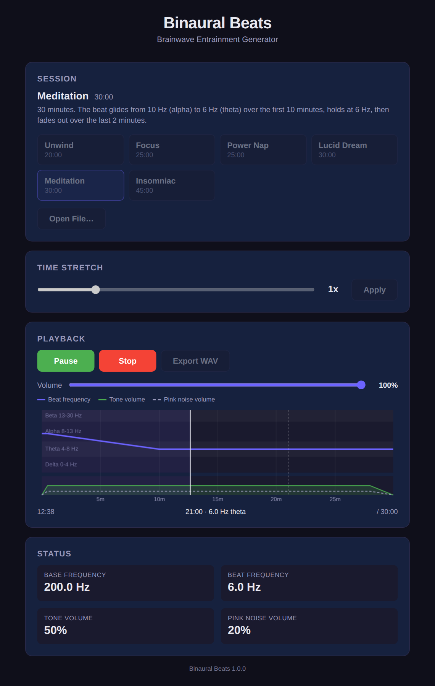

# **Binaural Beats Generator with Pink Noise and Configurable Parameters**

## **Introduction**

Go-based application that generates binaural beats with optional pink noise. It allows for customized audio sessions by specifying various parameters such as base frequency, beat frequency, volume levels, and pink noise settings over time through a YAML configuration file.

Binaural beats are auditory illusions perceived when two slightly different frequencies are presented to each ear separately. They are believed to influence brainwave patterns and can aid in relaxation, meditation, sleep, and focus. Use headphones: each ear needs its own tone.

It comes as an app for Windows, macOS, Linux and Android, and as command-line tools. See [Downloads](#downloads).



---

## **Features**

- **Customizable Frequencies**: Set base frequencies and beat frequencies that change over time.
- **Volume Control**: Adjust the volume of the tones and pink noise independently.
- **Pink Noise Integration**: Optionally include pink noise in your audio sessions.
- **Time-Based Configuration**: Specify frequency and volume changes at specific times.
- **Smooth Transitions**: Linear interpolation between frequency and volume changes for seamless transitions.
- **Apps for desktop and Android**: A built-in session library, a timeline of the session you can tap or drag to seek (plus a position slider and skip buttons), and pause, resume and volume control. On Android, sessions keep playing with the screen off.
- **Playlists**: Queue sessions to play one after another, crossfading between them (0 to 60 seconds, set in Settings), optionally repeating. The playlist is kept between launches and can be exported as one WAV file.
- **SBaGen Support**: Open SBaGen (`.sbg`) session files directly, or convert them to YAML.
- **WAV Export**: Render a whole session to a WAV file.
- **Command-Line Interface**: Play or export sessions from the command line, including the built-in presets.

---

## **Installation**

### **Prerequisites**

- **Go Programming Language**: Version 1.25 or higher.
- **Linux audio**: PulseAudio or PipeWire (most desktops), or ALSA. No build-time audio libraries or CGO are needed.

### **Clone the Repository**

```bash
git clone https://github.com/Wundark/binaural-beats.git
cd binaural-beats
```

---

## **Usage**

### **Playing a config**

Ensure you are in the project directory and have Go installed.

```bash
go run cmd/binaural-beats/main.go -config example_config/insomniac.yaml
```

The player also loads SBaGen files directly (`-config session.sbg`), and has a built-in session library:

```bash
go run cmd/binaural-beats/main.go -list-presets
go run cmd/binaural-beats/main.go -preset meditation
```

#### Command line options

* `-config` - Path to the session file: YAML, or SBaGen (`.sbg`)
* `-preset` - (OPTIONAL) Play a built-in session instead of `-config`
* `-list-presets` - (OPTIONAL) List the built-in sessions and exit
* `-output` - (OPTIONAL) Path for the WAV to be saved
* `-stretch` - (OPTIONAL) Stretch factor for playback time (default 1.0)
* `-volume` - (OPTIONAL) Playback volume from 0 to 1 (default 1.0; exports are always full volume)
* `-start` - (OPTIONAL) Start playback this many seconds into the session

### **Export a config to WAV**

WAV output files will be large. Around 400MB

```bash
go run cmd/binaural-beats/main.go -config example_config/insomniac.yaml -output insomniac.wav
```

### **Converting from SBG to YAML**

The player and apps open `.sbg` files directly, so converting is only needed to edit a session as YAML. The converter keeps the file's `##` title and description comments as `name` and `description`.

Ensure you are in the project directory and have Go installed.

```bash
go run cmd/converter/main.go -input insomniac.sbg -output config/insomniac.yaml
```

#### Command line options

* `-input` - Path to the SBG file
* `-output` - (OPTIONAL) Path to YAML output (default output to stdout)
* `-fade` - (OPTIONAL) Seconds to fade between tone-sets, like SBaGen's `-F` (default 60)

#### How SBaGen timing is converted

- Each tone-set is held until the next time-sequence line, then faded into the next tone-set over `-fade` seconds (shortened when the following line comes sooner).
- A line ending in `->` slides gradually into the next line's tone-set over the whole interval instead.
- Times relative to `NOW` start at 0. `NOW+hh:mm` and `+hh:mm` are offsets from the last `NOW` or clock time.
- Clock times (`22:00`) are converted relative to the first clock time, wrapping past midnight. A file cannot mix `NOW` and clock times.
- Fading to or from an off tone-set (`-`) changes only the volume, not the pitch.
- `carrier-beat` puts the lower frequency in the right ear and becomes a negative `beat_frequency`.
- Only one binaural tone per tone-set is supported. Amplitudes above 100% are clamped, with a warning.

---

## **YAML Configuration Guide**

The configuration file is written in YAML format and defines how the binaural beats and pink noise change over time.

### **Configuration Structure**

```yaml
name: <string>                  # Optional: shown in the apps (defaults to the file name)
description: <string>           # Optional: shown in the apps
frequency_changes:
  - time: <float>               # Time in seconds from the start of playback
    frequency: <float>          # Base frequency in Hz
    beat_frequency: <float>     # Beat frequency in Hz
    pink_noise_volume: <float>  # Pink noise volume (0.0 to 1.0)
    tone_volume: <float>        # Tone volume (0.0 to 1.0)
```

### **Parameter Descriptions**

- **time**: The point in time (in seconds) when the specified settings take effect. Settings change linearly between consecutive entries, and the last entry's time is when playback ends, so a session needs at least one entry with a time greater than 0. Entries are sorted by time; entries with equal times keep their order, which gives an instant change.
- **frequency**: The base frequency of the tone in Hertz (Hz), heard in the left ear.
- **beat_frequency**: The frequency difference between the left and right channels, creating the binaural beat effect. The right ear hears `frequency + beat_frequency`, so a negative value puts the lower tone on the right.
- **pink_noise_volume**: The volume level of the pink noise, ranging from 0.0 (silent) to 1.0 (maximum volume).
- **tone_volume**: The volume level of the tone, ranging from 0.0 to 1.0.

Configs are checked when loaded: unknown keys (such as a misspelled `frequency_changes`), negative times or frequencies, and volumes outside 0.0 to 1.0 are rejected with an error naming the entry.

### **Example Configuration**

```yaml
frequency_changes:
  - time: 0
    frequency: 300.0
    beat_frequency: 10.0
    pink_noise_volume: 0.4
    tone_volume: 0.1
  - time: 900
    frequency: 300.0
    beat_frequency: 10.0
    pink_noise_volume: 0.4
    tone_volume: 0.1
  - time: 1200
    frequency: 150.0
    beat_frequency: 6.0
    pink_noise_volume: 0.2
    tone_volume: 0.15
  - time: 1800
    frequency: 150.0
    beat_frequency: 6.0
    pink_noise_volume: 0.2
    tone_volume: 0.15
  - time: 2100
    frequency: 150.0
    beat_frequency: 2.0
    pink_noise_volume: 0.05
    tone_volume: 0.2
  - time: 2400
    frequency: 150.0
    beat_frequency: 2.0
    pink_noise_volume: 0.05
    tone_volume: 0.2
  - time: 2700
    frequency: 0.0
    beat_frequency: 0.0
    pink_noise_volume: 0.0
    tone_volume: 0.0
```

This example replicates the ["Insomniac" file](https://github.com/brainbang/sbagen_idoser/blob/master/sbg/insomniac.sbg) from the SBAGen format, converted into the YAML configuration for this application.

---

## **Project Structure**

- **cmd/binaural-beats/main.go**: The binaural beats player.
- **cmd/binaural-beats-lib/main.go**: C shared library build for Android FFI.
- **cmd/converter/main.go**: Convert from SBG to YAML.
- **internal/engine/**: Audio engine package (playback, WAV export, status).
- **internal/sbagen/**: SBaGen (`.sbg`) parser and converter, used by the engine and `cmd/converter`.
- **internal/presets/**: The built-in session library.
- **internal/rpc/**: JSON-RPC 2.0 server for IPC between Tauri and the Go engine.
- **tauri-app/**: Tauri v2 desktop/mobile app (Rust backend + HTML/JS frontend).
- **scripts/**: Build helper scripts for sidecars and Android libraries.
- **example_config/**: Example YAML sessions, embedded as the built-in session library.
- **.goreleaser.yaml**: GoReleaser cross-platform build configuration.
- **.github/workflows/**: CI, release, Android APK, and PR build workflows.

---

## **Downloads**

Everything is on the [GitHub Releases](https://github.com/Wundark/binaural-beats/releases) page.

**The app** (session library, timeline, pause/seek/volume):

- **Windows**: `.msi` or the `-setup.exe` installer
- **macOS**: `.dmg` for Apple Silicon (`aarch64`) or Intel (`x64`)
- **Linux**: `.deb`, `.rpm` or `.AppImage`
- **Android**: APK (arm64, armv7). Allow the notification permission so sessions keep playing with the screen off.

**Command-line tools** (`binaural-beats` player and `converter`): archives for Linux (amd64, arm64, armv7), macOS (amd64, arm64) and Windows (amd64). On Linux they play through PulseAudio or PipeWire, falling back to ALSA.

The installers are not signed by Apple or Microsoft yet, so the first launch shows a warning:

- **macOS**: right-click the app and choose **Open**, then **Open** again (or allow it under System Settings → Privacy & Security).
- **Windows**: in the SmartScreen dialog choose **More info → Run anyway**.
- **Android**: allow installing apps from your browser or file manager. Uninstall a build signed with a different key (such as a PR test build) before installing a release.

---

## **Desktop App (Tauri)**

A cross-platform GUI for desktop and Android is available via Tauri. It has a built-in session library, opens YAML and SBaGen files, and shows the session as a timeline of beat frequency over the brainwave bands (delta, theta, alpha, beta) with tone and noise volumes; click the timeline to seek. Playback can be paused and resumed, and has its own volume control.

On desktop it runs the Go audio engine as a sidecar process (`binaural-engine`, installed next to the app executable) and talks to it over JSON-RPC.

### **Prerequisites**

- [Node.js](https://nodejs.org/) 20+
- [Rust](https://rustup.rs/) (stable)
- Go 1.25+
- Platform dependencies for Tauri: see [Tauri prerequisites](https://v2.tauri.app/start/prerequisites/)

### **Build and Run**

```bash
# Build the Go engine sidecar for your platform
./scripts/build-sidecar.sh

# Install frontend dependencies and launch dev mode
cd tauri-app
npm ci
npm run tauri dev
```

### **Build for Distribution**

```bash
cd tauri-app
npm run tauri build
```

---

## **Android APK**

### **Prerequisites**

- Go 1.25+
- Android SDK + NDK 25.x (set `ANDROID_HOME`, and `ANDROID_NDK_HOME`/`NDK_HOME` to the NDK)
- Rust with Android targets: `rustup target add aarch64-linux-android armv7-linux-androideabi`
- Java 17+
- Node.js 20+ (the Tauri CLI is installed from `package-lock.json`)

### **Build**

```bash
# Build the Go shared libraries for Android
./scripts/build-android-lib.sh

# Build the APK (only arm64 and armv7 have Go engine libraries)
cd tauri-app
npm ci
npx tauri android build --apk --target aarch64 --target armv7

# Sign it so it can be installed (throwaway key unless ANDROID_KEYSTORE_* is set)
cd ..
./scripts/sign-apk.sh \
  tauri-app/src-tauri/gen/android/app/build/outputs/apk/universal/release/app-universal-release-unsigned.apk \
  binaural-beats.apk
```

The Android Studio project in `tauri-app/src-tauri/gen/android` was generated by `tauri android init`; regenerate it with that command rather than editing the Gradle plumbing by hand.

---

## **RPC Mode**

The binary supports a JSON-RPC 2.0 server mode for integration with frontends:

```bash
binaural-beats -rpc
```

This reads newline-delimited JSON-RPC requests from stdin and writes responses to stdout. Available methods:

| Method | Params | Description |
|--------|--------|-------------|
| `load_config` | `{"path": "config.yaml"}` | Load a session file (YAML or `.sbg`); returns its `name`, `description` and `total_duration` |
| `list_presets` | — | List the built-in sessions (`id`, `name`, `description`, `total_duration`) |
| `load_preset` | `{"id": "meditation"}` | Load a built-in session; returns the same info as `load_config` |
| `play` | — | Start real-time playback |
| `stop` | — | Stop playback |
| `pause` | — | Pause playback, keeping the position |
| `resume` | — | Resume paused playback |
| `seek` | `{"time": 600}` | Jump to a position in seconds (when stopped, sets where `play` starts) |
| `set_volume` | `{"volume": 0.5}` | Set the playback volume from 0 to 1 (exports are unaffected) |
| `get_status` | — | Get current playback status, including `is_paused`, `volume`, `stretch`, `playlist_index` and `remaining` (seconds until playback ends, or -1 for a repeating playlist) |
| `get_timeline` | — | Get the loaded session's info and its `changes`, with times stretched |
| `export_wav` | `{"path": "output.wav"}` | Export session to WAV file |
| `set_stretch` | `{"factor": 1.5}` | Set time stretch factor |
| `get_playlist` | — | Get the playlist: `items` (each with `name`, `description`, `total_duration` and its `config`), `current` (the loaded session's index, or -1), `crossfade` and `loop` |
| `playlist_add` | `{"config": {...}}` (optional) | Add a session given as a config (as in a YAML file, or an item's `config`), or without params, add the loaded session, which then plays as part of the playlist |
| `playlist_remove` | `{"index": 0}` | Remove an item |
| `playlist_move` | `{"from": 0, "to": 2}` | Move an item |
| `playlist_clear` | — | Empty the playlist |
| `playlist_select` | `{"index": 1}` | Load an item; while playing, crossfade to it |
| `set_playlist_options` | `{"crossfade": 10, "loop": false}` | Set the crossfade in seconds (0 to 120) and whether the playlist repeats |
| `export_playlist_wav` | `{"path": "playlist.wav"}` | Export the whole playlist, with its crossfades, to a WAV file |

When the loaded session is in the playlist, `play` continues through the rest of the playlist after it.

Example:

```bash
echo '{"jsonrpc":"2.0","method":"load_config","params":{"path":"example_config/insomniac.yaml"},"id":1}' | binaural-beats -rpc
```

---

## **Creating a Release**

Releases are fully automated via GitHub Actions. To create a release:

```bash
# 1. Tag the commit
git tag v0.1.0

# 2. Push the tag
git push origin v0.1.0
```

This triggers three workflows:

1. **Release** (`.github/workflows/release.yml`) — Builds the command-line tools for all platforms via GoReleaser and creates a GitHub Release with archives + checksums.
2. **Desktop App** (`.github/workflows/desktop.yml`) — Builds the app installers for Linux, macOS (Apple Silicon and Intel) and Windows and attaches them to the release.
3. **Android APK** (`.github/workflows/android.yml`) — Builds the Android APK via Tauri and attaches it to the release.

### **Release checklist**

1. Set the version in `tauri-app/src-tauri/tauri.conf.json`, `tauri-app/src-tauri/Cargo.toml` and `tauri-app/package.json` (the tag should match, e.g. `v0.1.0` for `0.1.0`). The Android version code is derived from it.
2. Add the Android signing secrets once (below), so every release is signed with the same key and updates install over earlier versions.
3. Tag and push as above, then check the release has the archives, installers and APK.

### **Android signing (one-time)**

Without these repository secrets, release APKs are signed with a throwaway key and cannot be updated in place:

```bash
keytool -genkeypair -keystore release.jks -alias binaural-beats -keyalg RSA -keysize 4096 -validity 10000
base64 -w0 release.jks   # paste as ANDROID_KEYSTORE_BASE64
```

Add `ANDROID_KEYSTORE_BASE64`, `ANDROID_KEYSTORE_PASSWORD` and `ANDROID_KEY_ALIAS` under **Settings → Secrets and variables → Actions**, and keep `release.jks` backed up: losing it means users must uninstall to update.

### **Version format**

Tags must match `v*` and use plain `MAJOR.MINOR.PATCH` numbers (e.g., `v0.1.0`): Windows installers (MSI) cannot use labels such as `-beta`. Versions below 1.0.0 are published as GitHub pre-releases; at 1.0.0, set `prerelease: auto` in `.goreleaser.yaml`.

### **PR builds**

Every pull request automatically builds snapshot binaries, the Linux app installers and an Android APK, uploaded as workflow artifacts. External contributors require approval via the `pr-builds` GitHub environment before builds run.

---

## **CI/CD Overview**

| Workflow | Trigger | What it does |
|----------|---------|-------------|
| **CI** | Push / PR | `go vet`, tests, multi-platform build, GoReleaser snapshot, Tauri fmt/clippy |
| **Release** | Tag `v*` | Full GoReleaser release to GitHub Releases |
| **Desktop App** | Tag `v*` / PR / manual | App installers (all platforms on tags, Linux on PRs) |
| **Android APK** | Tag `v*` / manual | Build + upload Android APK to release |
| **PR Release** | Pull request | Snapshot binaries + APK as PR artifacts |

### **Environment setup (one-time)**

For the PR approval gate to work for external contributors, create a GitHub environment:

1. Repo **Settings → Environments → New environment** → name it `pr-builds`
2. Add `Wundark` as a required reviewer
3. Save

---

## **Acknowledgments**

- **GoPXL Beep Library**: For providing audio playback and manipulation capabilities.
- **SBAGen**: Inspiration for the audio session configurations.